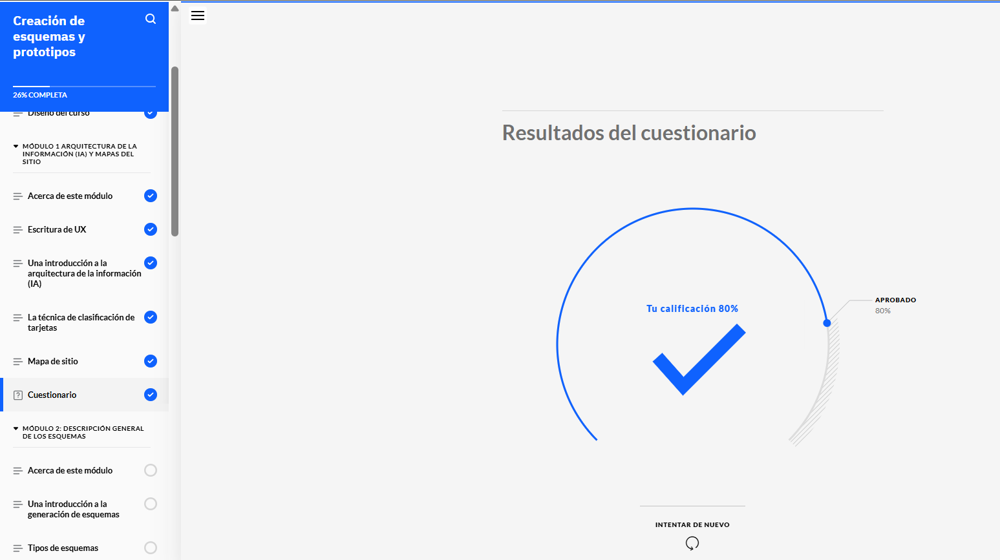
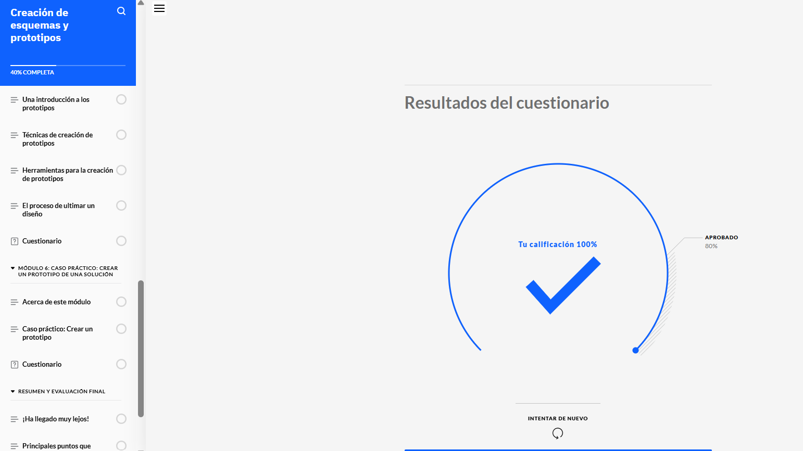
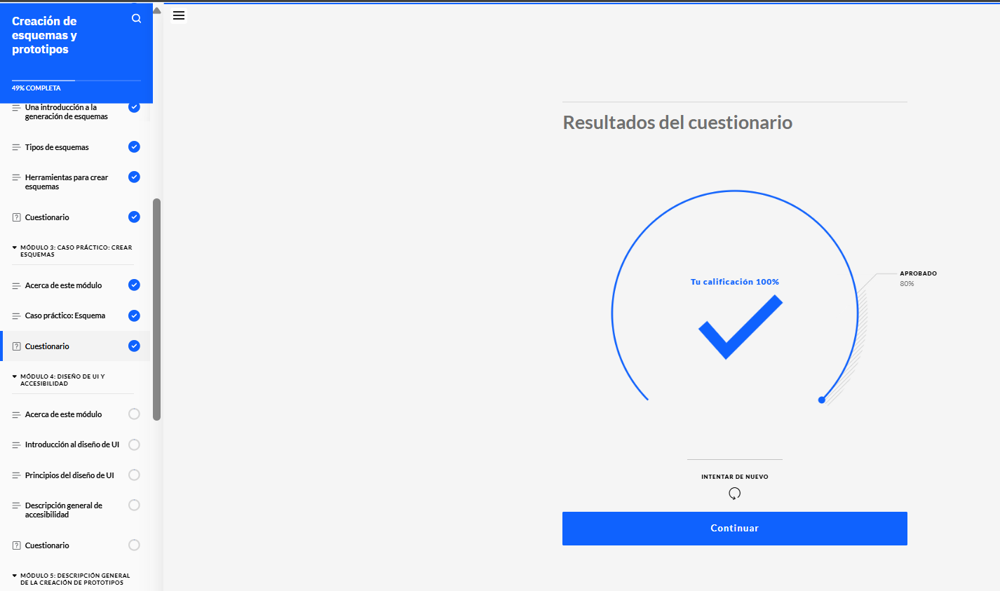
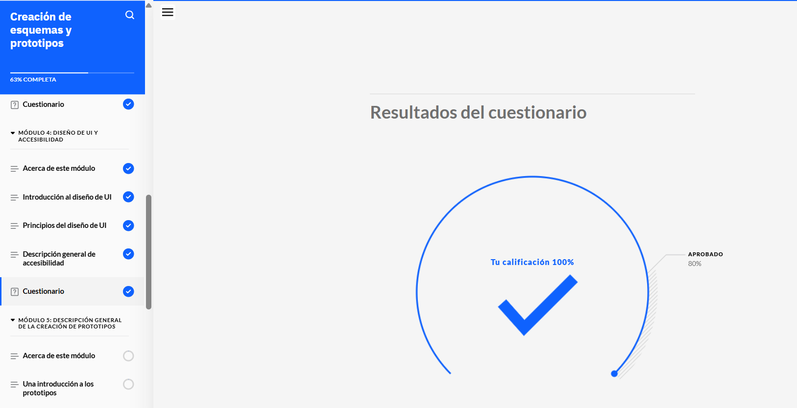
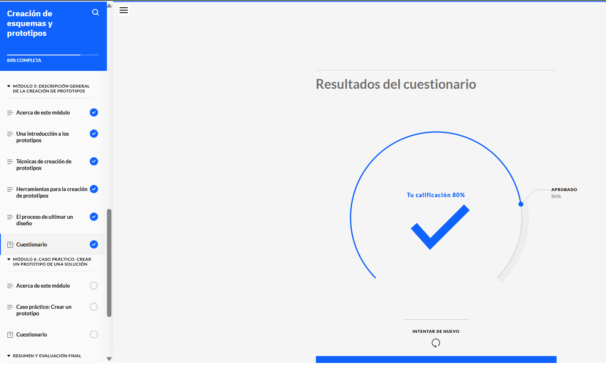
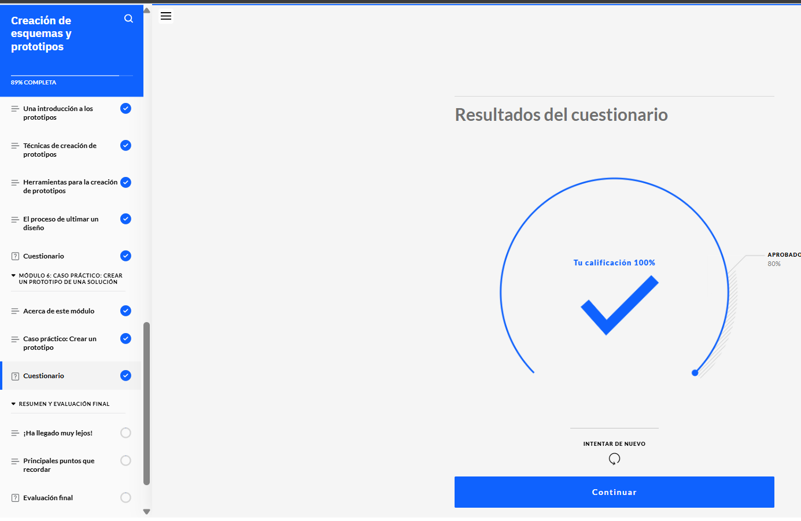

# Creación de esquemas y prototipos

## Introducción

La creación de esquemas y prototipos es una etapa esencial en el diseño de experiencia de usuario (UX). A través de estos, los diseñadores pueden visualizar la estructura, disposición y funcionalidades de una interfaz antes de su desarrollo. Este proceso ayuda a comunicar ideas, iterar sobre soluciones y validar conceptos con usuarios y partes interesadas.

## Objetivo de la creación de esquemas y prototipos

El principal objetivo de esta fase es:

- Representar de manera visual la arquitectura y funcionalidad de la interfaz.
- Facilitar la comunicación entre diseñadores, desarrolladores y clientes.
- Evaluar la usabilidad y accesibilidad del diseño.
- Detectar y corregir posibles problemas antes del desarrollo final.

## Tipos de esquemas

Los esquemas son representaciones simplificadas de una interfaz que destacan la estructura y jerarquía de la información. Existen tres tipos principales:

- **Esquemas de baja fidelidad**: Diseños básicos sin detalles visuales, enfocados en la estructura y funcionalidad.
- **Esquemas de media fidelidad**: Incorporan más detalles visuales y tipografía, pero sin diseño final.
- **Esquemas de alta fidelidad**: Diseños detallados con colores, tipografías y elementos finales, que se asemejan al producto final.

## Proceso de creación de esquemas

Para desarrollar esquemas efectivos, los diseñadores siguen estos pasos:

1. Definir objetivos y requisitos de la interfaz.
2. Establecer la arquitectura de la información.
3. Crear un bosquejo inicial en papel o herramientas digitales.
4. Refinar el esquema con base en retroalimentación.
5. Validar la usabilidad antes de avanzar al prototipo.

## Prototipos en UX

Un prototipo es una representación interactiva de un producto digital que permite a los diseñadores y desarrolladores probar la funcionalidad antes de la implementación final.

### Tipos de prototipos

- **Prototipos en papel**: Bocetos rápidos que representan la interacción básica.
- **Prototipos digitales**: Simulaciones interactivas creadas con herramientas como Figma, Adobe XD o Sketch.
- **Prototipos de alta fidelidad**: Versiones casi finales que replican el diseño y comportamiento del producto real.

### Importancia de los prototipos

Los prototipos permiten:

- Identificar problemas de usabilidad antes del desarrollo.
- Recibir retroalimentación de usuarios y partes interesadas.
- Reducir costos y tiempo de desarrollo.
- Simular la experiencia del usuario en escenarios reales.

## Pasos en la creación de prototipos

1. **Definir el alcance y funcionalidades principales.**
2. **Seleccionar la fidelidad adecuada.** Dependiendo del propósito del prototipo.
3. **Construir el prototipo.** Utilizando herramientas digitales o bocetos en papel.
4. **Realizar pruebas de usabilidad.** Obtener retroalimentación de los usuarios.
5. **Iterar y mejorar.** Ajustar el diseño con base en los resultados de las pruebas.

## Evidencias del curso

A continuación, se presentan algunas imágenes como evidencia del curso:

## Conclusión

La creación de esquemas y prototipos es una fase fundamental en el diseño UX/UI, ya que permite visualizar, probar y optimizar las interfaces antes de su desarrollo final. Con herramientas y metodologías adecuadas, los diseñadores pueden mejorar la usabilidad, accesibilidad y experiencia del usuario en los productos digitales.