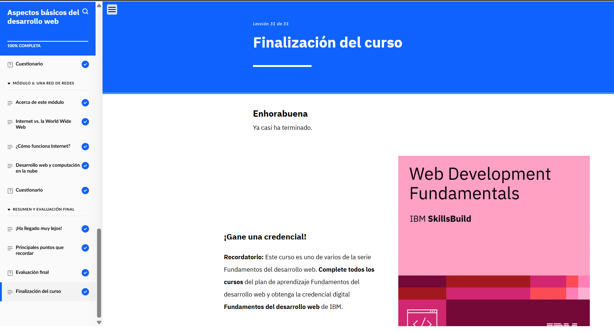
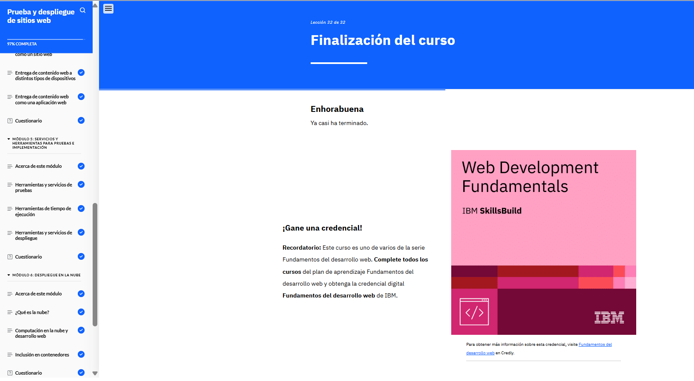
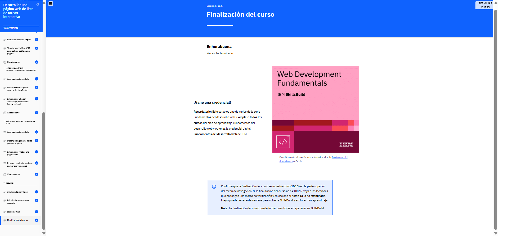
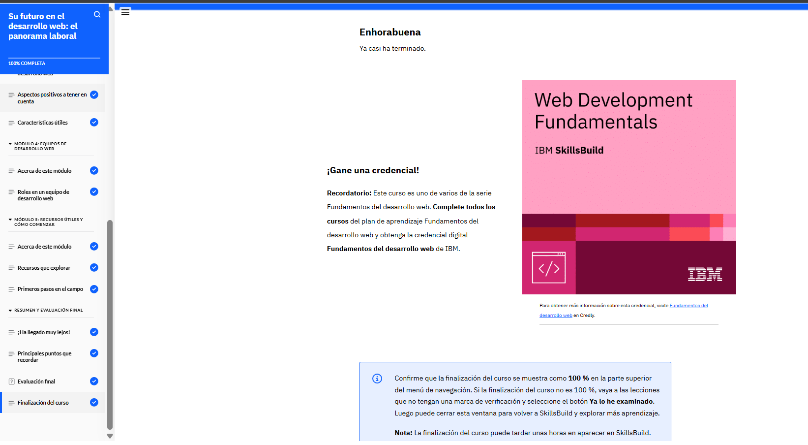

# Fundamentos del diseño de experiencias de usuario (¡Obtenga una credencial!)

## Plan de formación

## Cursos

## Certificado

## Módulos

### 01. Aspectos básicos del desarrollo web

)
Este módulo introduce los conceptos esenciales para crear sitios web, explicando cómo funcionan los ordenadores (entrada, proceso, salida y almacenamiento), la diferencia entre hardware (componentes físicos) y software (programas), y los roles del desarrollo front-end (interfaz de usuario con HTML, CSS y JavaScript) y back-end (lógica del servidor con Python, Java o Node.js). También cubre cómo Internet y la World Wide Web (WWW) facilitan la comunicación global, el uso de APIs para conectar sistemas, y las etapas clave del desarrollo web (planificación, codificación, pruebas y despliegue), destacando la importancia de la nube para alojar aplicaciones escalables. En resumen, ofrece una base sólida para entender cómo se construye y funciona la web moderna.

### 02. Desarrollo de sitios para la web

Este módulo introduce los fundamentos para crear páginas web funcionales y atractivas, combinando HTML (estructura), CSS (estilo) y JavaScript (interactividad). Aprenderás a diseñar layouts con etiquetas semánticas, aplicar estilos mediante selectores (clases, IDs) y añadir dinamismo con eventos básicos, siguiendo buenas prácticas de desarrollo web y metodologías ágiles para proyectos escalables. También cubre la diferencia entre arquitecturas (monolitos vs. microservicios) y cómo elegir herramientas según el contexto del proyecto.

### 03. Introducción a HTML y CSS

Este módulo se enfoca en construir sitios web funcionales y atractivos combinando tres tecnologías clave: HTML (para estructura y contenido), CSS (para diseño y estilos visuales) y JavaScript (para interactividad y dinamismo). Aprenderás desde conceptos básicos como etiquetas semánticas, selectores CSS y eventos JS, hasta buenas prácticas de organización de código, herencia de estilos y uso de herramientas como IDEs. También cubre la importancia de metodologías ágiles y arquitecturas escalables (como monolitos o microservicios) para proyectos colaborativos.

### 04. Creación de sitios web dinámicos con JavaScript

El módulo enseña a desarrollar aplicaciones web dinámicas integrando front-end (HTML, eventos, DOM) y back-end (Node.js, bases de datos SQL con operaciones CRUD). Cubre fundamentos clave como sintaxis de JavaScript (variables, objetos, funciones), interacción con páginas web, manejo de datos (desde concatenar strings hasta consultas SQL con WHERE), y buenas prácticas como modularización con archivos externos. El objetivo es que domines el flujo completo: desde la interfaz de usuario hasta la lógica del servidor y la gestión de datos, usando JavaScript como tecnología central.

### 05. Prueba y despliegue de sitios web

El módulo enfoca los procesos clave para garantizar que un sitio web funcione correctamente antes y después de su lanzamiento. Cubre pruebas de calidad (usabilidad, rendimiento, compatibilidad y seguridad) para identificar errores, así como estrategias de despliegue continuo (CI/CD) que automatizan la publicación de actualizaciones de manera segura y eficiente. También aborda el uso de herramientas como sistemas de control de versiones (Git), entornos de staging y plataformas en la nube para gestionar el lanzamiento, asegurando que el sitio sea estable, escalable y accesible para los usuarios en todos los dispositivos. En esencia, este módulo enseña a entregar productos web robustos y actualizados con agilidad. 🚀

### 06. Desarrollar una página web de lista de tareas interactive

El guía la creación de una aplicación web funcional usando tecnologías clave: HTML para la estructura básica (formulario y lista), CSS para el diseño responsive (adaptable a móviles y desktop con estilos alineados a la marca) y JavaScript para implementar la lógica interactiva (añadir tareas con botón o tecla Intro, marcarlas como completadas y validar entradas). Se enfoca en seguir especificaciones de diseño (wireframes) y requisitos funcionales, mientras se aplican buenas prácticas como modularización del código, eventos DOM y pruebas de usabilidad. El proyecto replica un escenario real de desarrollo, integrando trabajo en equipo con roles de diseñador y gestor de producto.

### 07. Su futuro en el desarrollo web: el panorama laboral

El módulo explora las oportunidades profesionales en el campo del desarrollo web, destacando roles clave (front-end, back-end, full-stack), habilidades técnicas (HTML, CSS, JavaScript, frameworks) y competencias blandas (comunicación, trabajo en equipo) demandadas por la industria. También analiza tendencias del mercado, como la especialización en tecnologías específicas y la adaptabilidad en un sector en constante evolución.
