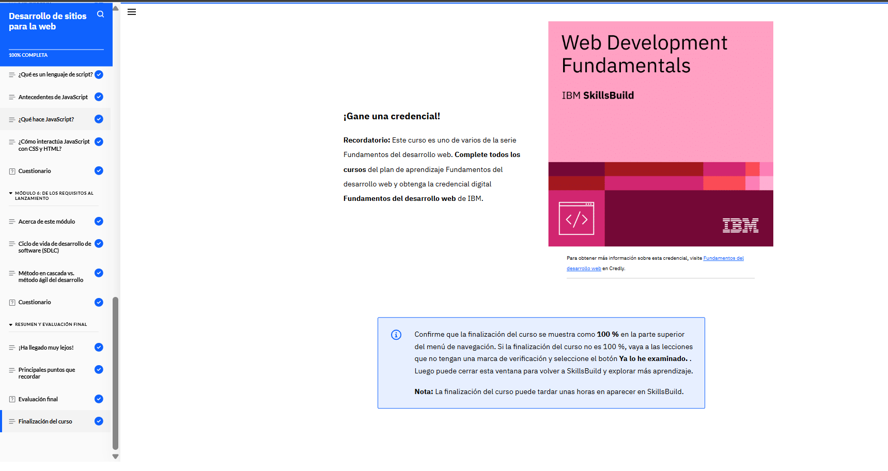
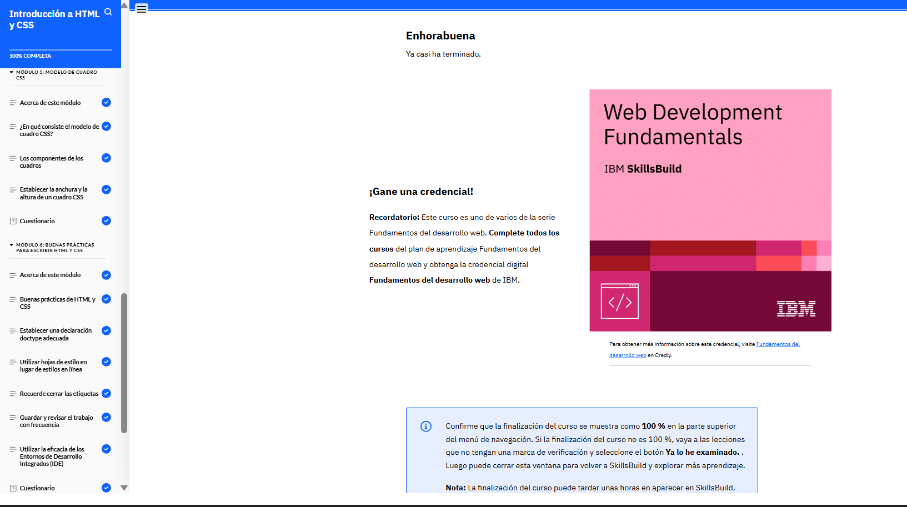
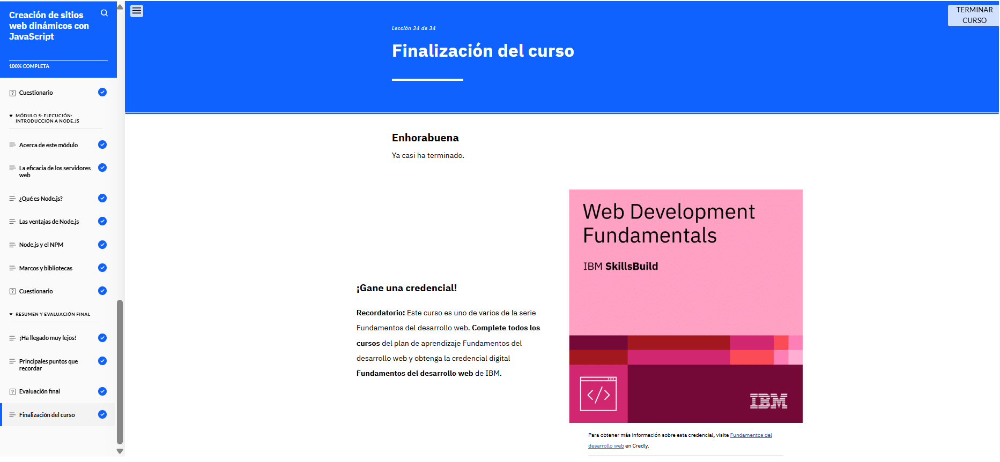

# Fundamentos del diseño de experiencias de usuario (¡Obtenga una credencial!)

## Plan de formación

## Cursos

## Certificado

## Módulos

### 01. Aspectos básicos del desarrollo web

)
Este módulo introduce los conceptos esenciales para crear sitios web, explicando cómo funcionan los ordenadores (entrada, proceso, salida y almacenamiento), la diferencia entre hardware (componentes físicos) y software (programas), y los roles del desarrollo front-end (interfaz de usuario con HTML, CSS y JavaScript) y back-end (lógica del servidor con Python, Java o Node.js). También cubre cómo Internet y la World Wide Web (WWW) facilitan la comunicación global, el uso de APIs para conectar sistemas, y las etapas clave del desarrollo web (planificación, codificación, pruebas y despliegue), destacando la importancia de la nube para alojar aplicaciones escalables. En resumen, ofrece una base sólida para entender cómo se construye y funciona la web moderna.

### 02. Desarrollo de sitios para la web

Este módulo introduce los fundamentos para crear páginas web funcionales y atractivas, combinando HTML (estructura), CSS (estilo) y JavaScript (interactividad). Aprenderás a diseñar layouts con etiquetas semánticas, aplicar estilos mediante selectores (clases, IDs) y añadir dinamismo con eventos básicos, siguiendo buenas prácticas de desarrollo web y metodologías ágiles para proyectos escalables. También cubre la diferencia entre arquitecturas (monolitos vs. microservicios) y cómo elegir herramientas según el contexto del proyecto.

### 03. Introducción a HTML y CSS

Este módulo se enfoca en construir sitios web funcionales y atractivos combinando tres tecnologías clave: HTML (para estructura y contenido), CSS (para diseño y estilos visuales) y JavaScript (para interactividad y dinamismo). Aprenderás desde conceptos básicos como etiquetas semánticas, selectores CSS y eventos JS, hasta buenas prácticas de organización de código, herencia de estilos y uso de herramientas como IDEs. También cubre la importancia de metodologías ágiles y arquitecturas escalables (como monolitos o microservicios) para proyectos colaborativos.

### 04. Creación de sitios web dinámicos con JavaScript

Aquí, los estu

### 05. Pruebas de facilidad de uso y obtención de comentarios

Este módulo enseña cómo realizar pruebas de usabilidad para evaluar la efectividad de los diseños. Los participantes aprenderán a recopilar y analizar comentarios de los usuarios, utilizando esta información para iterar y mejorar los diseños.

### 06. Trabajar en colaboración con equipos en proyectos de diseño de UX

Este módulo se enfoca en las habilidades de colaboración necesarias para trabajar en equipos multidisciplinarios de diseño de UX. Los estudiantes aprenderán a comunicarse efectivamente, compartir ideas y trabajar juntos para lograr objetivos comunes.

### 07. Su futuro en el diseño de UX: el panorama laboral

