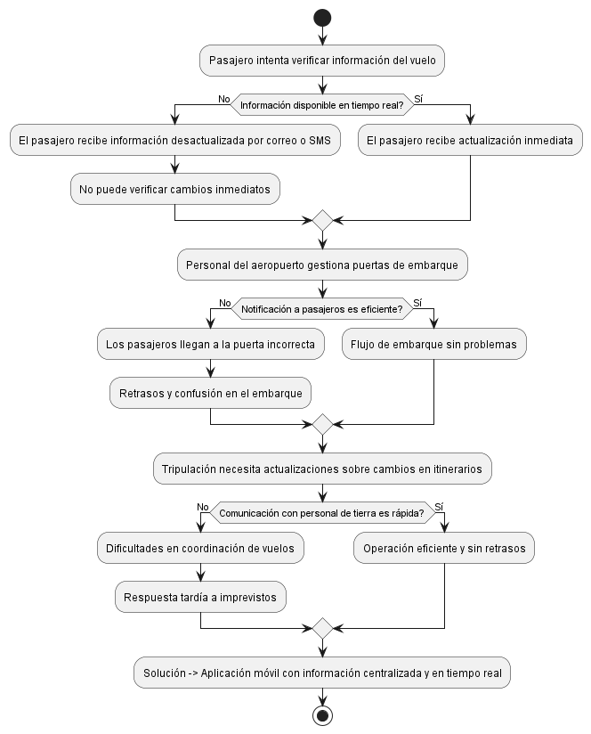
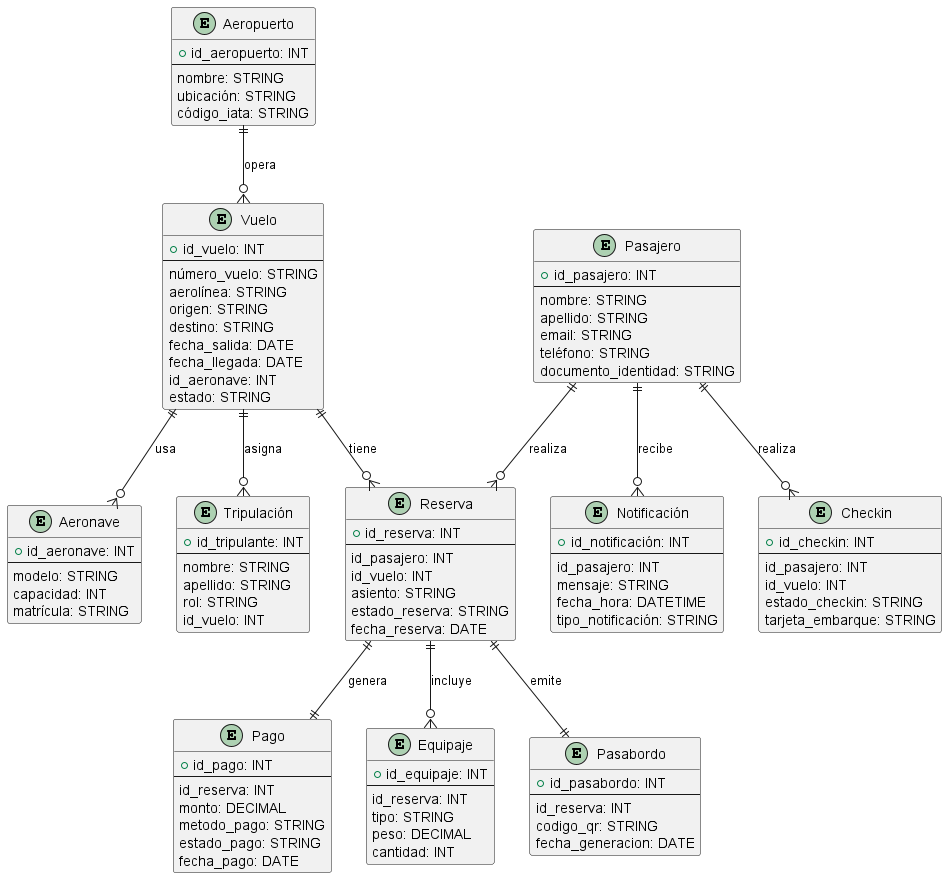

# Explicación del Diagrama de Problema en la Gestión de Vuelos

El diagrama conceptual refleja la problemática en la gestión y control de vuelos debido a la falta de una solución móvil integrada. En este contexto, se identifican diversas dificultades que afectan tanto a pasajeros como al personal de aerolíneas y aeropuertos.

Se presentan problemas como la falta de acceso a información actualizada sobre vuelos, lo que genera incertidumbre en los pasajeros y puede derivar en retrasos. Además, la comunicación ineficiente entre la tripulación y el personal de tierra ocasiona dificultades en la coordinación operativa, aumentando los tiempos de respuesta ante imprevistos. La ausencia de un sistema centralizado también impacta la organización en el embarque y la integración con otros servicios aeroportuarios.

Como solución, el diagrama propone el desarrollo de una aplicación móvil que unifique y optimice la gestión de información en tiempo real, mejorando la experiencia del usuario y la eficiencia operativa.

## Exportación del Diagrama

## **📌 Entidades y Relaciones del Modelo Relacional**
Cada entidad en este diagrama representa un conjunto de datos con atributos que definen su estructura.

1. **`Pasajero`**  
   - Almacena información de los clientes que reservan vuelos.  
   - Relación **1:N** con `Reserva` porque un pasajero puede hacer varias reservas.

2. **`Vuelo`**  
   - Contiene los detalles del vuelo, como aerolínea, origen, destino y aeronave asignada.  
   - Relación **1:N** con `Reserva` porque un vuelo puede tener múltiples reservas.  
   - Relación **1:N** con `Tripulación`, ya que un vuelo puede asignar varios tripulantes.  
   - Relación **N:1** con `Aeropuerto`, pues un aeropuerto puede operar múltiples vuelos.

3. **`Reserva`**  
   - Vincula un pasajero con un vuelo específico, permitiéndole seleccionar un asiento y gestionar su estado.  
   - Relación **1:1** con `Pago`, ya que cada reserva genera un único pago.  
   - Relación **1:N** con `Equipaje`, porque una reserva puede incluir múltiples piezas de equipaje.  
   - Relación **1:1** con `Pasabordo`, porque a cada reserva le corresponde un pasabordo único.

4. **`Pago`**  
   - Guarda el monto, método de pago y estado de una transacción.  
   - Relación **1:1** con `Reserva` porque cada reserva tiene un único pago asociado.

5. **`Equipaje`**  
   - Representa las piezas de equipaje asociadas a una reserva, registrando tipo, peso y cantidad.  
   - Relación **N:1** con `Reserva`, pues una reserva puede tener varios equipajes.

6. **`Pasabordo`**  
   - Contiene un código QR generado para una reserva específica, permitiendo el acceso al vuelo.  
   - Relación **1:1** con `Reserva`, ya que cada pasabordo pertenece a una única reserva.

7. **`Tripulación`**  
   - Almacena los datos de los tripulantes de un vuelo.  
   - Relación **N:1** con `Vuelo`, ya que un vuelo tiene múltiples tripulantes asignados.

8. **`Notificación`**  
   - Representa los mensajes enviados a los pasajeros sobre actualizaciones del vuelo.  
   - Relación **N:1** con `Pasajero`, pues un pasajero puede recibir varias notificaciones.

9. **`Aeronave`**  
   - Contiene la información sobre el avión utilizado en un vuelo.  
   - Relación **1:N** con `Vuelo`, porque una aeronave puede operar varios vuelos.

10. **`Checkin`**  
   - Registra el estado del check-in del pasajero y si se ha emitido su tarjeta de embarque.  
   - Relación **1:1** con `Pasajero` y `Vuelo`, pues cada pasajero hace check-in para un único vuelo.

## Exportación del Diagrama

---

## **📌 Normalización hasta la 3NF con Justificación**
La normalización busca eliminar redundancias y garantizar la integridad de los datos. A continuación, explico cómo este modelo cumple con las tres primeras formas normales.

### **✅ Primera Forma Normal (1NF)**
- Cada tabla tiene una **clave primaria única** (`id_*`).
- Todos los atributos contienen **valores atómicos** (sin listas ni conjuntos de datos en una sola celda).
- No hay **atributos repetidos** ni grupos de datos dentro de una misma entidad.

**Ejemplo aplicado**:  
En `Pasajero`, los datos como `nombre`, `apellido`, `email` y `teléfono` son atómicos, evitando listas dentro de un solo campo.

---

### **✅ Segunda Forma Normal (2NF)**
- Se cumplen todas las reglas de la **1NF**.
- **No existen dependencias parciales** en tablas con claves compuestas.
- **Todas las columnas dependen completamente de la clave primaria**.

**Ejemplo aplicado**:  
En `Reserva`, los atributos `id_pasajero` e `id_vuelo` son claves foráneas que forman la relación sin depender parcialmente de una clave primaria compuesta.

---

### **✅ Tercera Forma Normal (3NF)**
- Se cumplen todas las reglas de la **2NF**.
- **No existen dependencias transitivas** (es decir, que un atributo dependa de otro que no sea clave primaria).

**Ejemplo aplicado**:  
En `Pago`, el `monto` y el `método_pago` dependen **directamente** de `id_pago`, sin depender de otros atributos que no sean clave primaria.  
Si `método_pago` estuviera en `Reserva`, habría una dependencia transitiva, lo cual rompería la 3NF.

