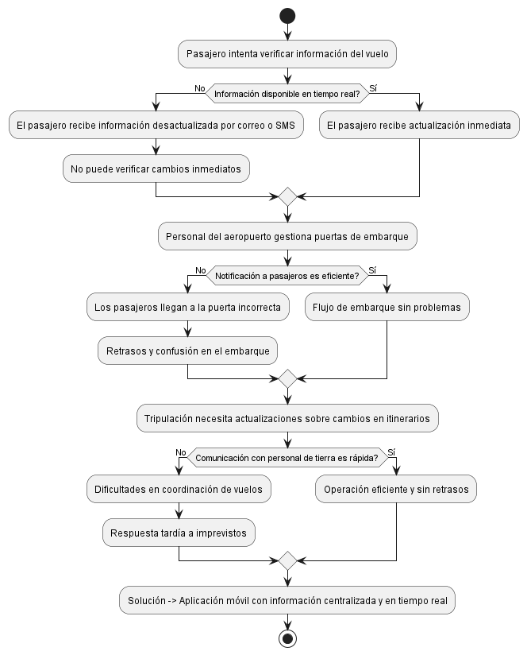

# Explicación del Diagrama de Problema en la Gestión de Vuelos

El diagrama conceptual refleja la problemática en la gestión y control de vuelos debido a la falta de una solución móvil integrada. En este contexto, se identifican diversas dificultades que afectan tanto a pasajeros como al personal de aerolíneas y aeropuertos.

Se presentan problemas como la falta de acceso a información actualizada sobre vuelos, lo que genera incertidumbre en los pasajeros y puede derivar en retrasos. Además, la comunicación ineficiente entre la tripulación y el personal de tierra ocasiona dificultades en la coordinación operativa, aumentando los tiempos de respuesta ante imprevistos. La ausencia de un sistema centralizado también impacta la organización en el embarque y la integración con otros servicios aeroportuarios.

Como solución, el diagrama propone el desarrollo de una aplicación móvil que unifique y optimice la gestión de información en tiempo real, mejorando la experiencia del usuario y la eficiencia operativa.

## Exportación del Diagrama

